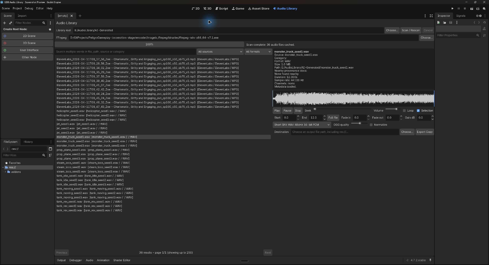
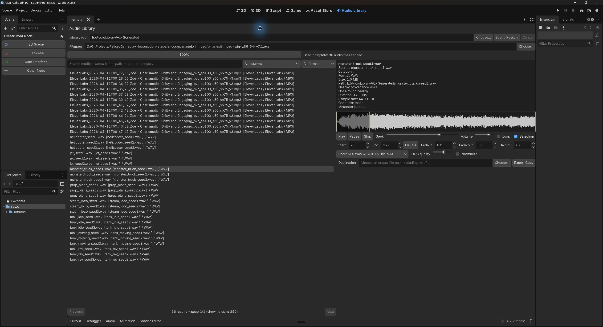

# GDB Audio Library

**Coming soon — development source, not a stable release.**

A free, MIT-licensed Godot editor addon for searching your audio collection, auditioning
clips, editing selections and exporting game-ready copies. Our first planned
community tool from GameDevBuddy and Peligro Express.

The implementation is available here for development. Full-library performance,
editor usability and audible preview/loop testing are still outstanding.
No release package or supported production version has been published.

## What is implemented

- Cached filename/path search with source and format filters, and paged results.
- Audio preview, looping and an interactive waveform/trim selection.
- Non-destructive trim, fades, gain and optional normalization.
- WAV 48 kHz / 16-bit PCM and OGG Vorbis export, with provenance recipe sidecars.
- Source files remain read-only; exports create new copies and avoid collisions.

WAV, OGG and MP3 preview through Godot. FLAC, AIF, AIFF and M4A use FFmpeg for
cached WAV previews. FFmpeg also provides probing, waveform generation and export.
Bring your own audio and FFmpeg executable; neither is bundled with this source.

## Editor screenshots

Captured from the real addon running in Godot 4.7.2 on 17 September 2026.
This is the current development interface, using a small external collection;
these screenshots are not evidence of full-library performance or release readiness.
The audio files shown are not bundled with the addon.

### Browse and inspect audio



### Prepare a non-destructive trim



The shaded waveform marks the excluded opening two seconds. The selection is
an editing recipe; the original audio file is unchanged. No export is claimed
by this screenshot.

## Development installation

The repository root is the addon directory. From your Godot project's root:

```sh
git submodule add https://github.com/gdb-godot/GDBAudioLibrary.git addons/gdb_audio_library
```

For a clone that already includes the submodule:

```sh
git submodule update --init addons/gdb_audio_library
```

You can instead copy this repository's files into `addons/gdb_audio_library`.
Keep that exact folder name: scripts reference it through `res://addons/`.

1. Enable **GDB Audio Library** in **Project Settings > Plugins**.
2. Open the **Audio Library** editor main screen.
3. Choose your external audio-library folder and FFmpeg executable.
4. Scan, select a file, preview it, and export a new copy outside the source library.

Settings and catalog/preview caches are local to `user://gdb_audio_library`.
The standalone Control in `preview.tscn` can also be opened inside a Godot project.
The addon has no Peligro, UGF or character-footstep runtime dependencies.

## Verification and remaining work

Development checks have run on Windows using Godot 4.7.2. These checks load the
enabled plugin in a clean project and use tiny generated fixtures to exercise
scan/selection, waveform, copy-based exports, loops and original-file preservation.
They are not a full-library benchmark or a listening/visual acceptance pass.

Run them from a consumer project's root, substituting your executable paths:

```sh
python addons/gdb_audio_library/validation/validate_export_workflow.py --godot /path/to/godot --ffmpeg /path/to/ffmpeg
```

Before the first release:

- Trial a large real library and tune scan/search responsiveness.
- Review editor layout, waveform editing and audible preview/loop behaviour.
- Confirm supported engine versions and platforms.
- Finish release packaging and usage documentation.

Directory links are skipped while scanning. Export checks reject source-library
writes and detected filesystem aliases. Nearby README/LICENSE documents are
recorded as provenance only. FFmpeg work shows a busy/failure state, not an exact
percentage. Large audio masters can take time to decode.

## Project status

Issues are enabled for development feedback. The addon is **free and licensed
under the [MIT License](LICENSE)**. "Coming soon" is the current release status;
no launch date is promised. The licence covers this addon source, not the audio
files you bring to it or separately installed FFmpeg binaries.
